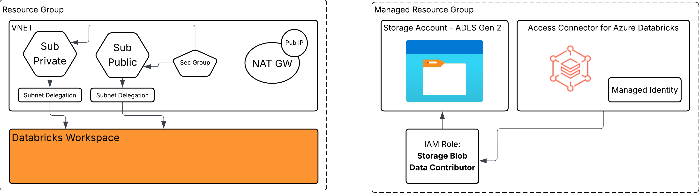

# Azure Workspace with VNET Injection - STS

*last update: 07/21/2025* <br>
*reviewed by: Thais Henrique*

## Prerequisite: 
You need to have the Azure CLI Installed:

* [Install Azure CLI](https://learn.microsoft.com/en-us/cli/azure/install-azure-cli?view=azure-cli-latest)
* [Sing in Options](https://learn.microsoft.com/en-us/cli/azure/authenticate-azure-cli?view=azure-cli-latest#sign-into-azure-with-azure-cli)
* [Interactive Login (az login)](https://learn.microsoft.com/en-us/cli/azure/authenticate-azure-cli-interactively?view=azure-cli-latest)

## Authentication

We are using Azure CLI for Authentication
Run this on the Terminal where you are going to execute Terraform.
```
az login
```

Documentation:
* [Install Azure CLI](https://learn.microsoft.com/en-us/cli/azure/install-azure-cli?view=azure-cli-latest)
* [Sing in Options](https://learn.microsoft.com/en-us/cli/azure/authenticate-azure-cli?view=azure-cli-latest#sign-into-azure-with-azure-cli)
* [Interactive Login (az login)](https://learn.microsoft.com/en-us/cli/azure/authenticate-azure-cli-interactively?view=azure-cli-latest)


You can use other authentication methods, but be sure to configure the "provider.tf" file correctly.

## How to use this Terraform?

This terraform will deploy and configure a DAtabricks Workspace with VNET Injection and Unity Catalog enabled

1. Open the file "variable.auto.tfvars.example" and fill all the variables\

2. Save the changes and rename the file to "variable.auto.tfvars".


Note:
> The identity that you use in `az login` to deploy this template should have contributor role in your azure subscription, or the minimum required permissions to deploy resources in this template.


3. Deploy to your Azure environment

* Run `terraform init` to initialize terraform and download required providers.

* Run `terraform plan` to see what resources will be deployed.

* Run `terraform apply` to deploy resources to your Azure environment. Since we used `az login` method to authenticate to providers, you will be prompted to login to Azure via browser. Enter `yes` when prompted to deploy resources.

4. Verify deployment:

Navigate to Azure Portal and verify that all resources were deployed successfully. You should now have a vnet-injected workspace with one cluster deployed.


### Which resource this terraform creates?

List of reources:

* Resource Group
* Databricks Managed Resource Group
* VNET with 2 subnets (host and container)
* Delegation for the Subnet to Databricks Workspace
* Security Group with the rules already added
* NAT Gateway and a Public IP for the NAT.
* Storage Account and some containers
* Access Connector for Azure Databricks
* Managed Identity for the Access Connector
* IAM Roles for the Access Connector on the Storage account

All the Azure Resource that will be created:




### Variables required

You need to fill all the variable on the file: ***variable.auto.tfvars***.

- prefix
- location
- adb_account_id
- subscription_id
- metastore_owner
- tags

### Understanding the modules

#### Workspace

This module creates all the resource related to Azure Portal, including the Azure Databricks Workspace

#### Unity Catalog

Create a new Storage Account with a new container.
Create a metasote for the region.
Assign the Metasote to the workspace.